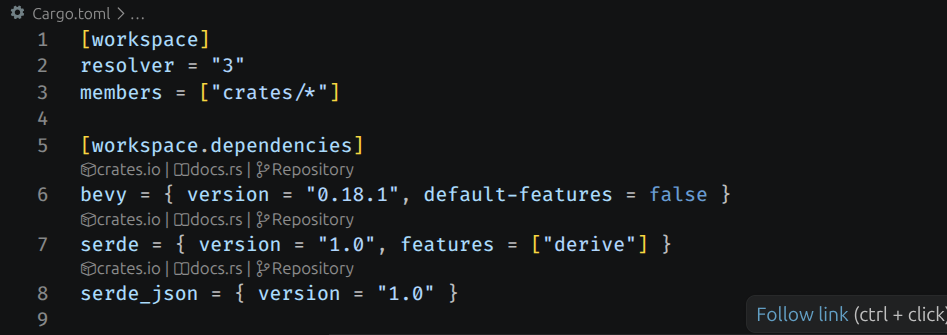
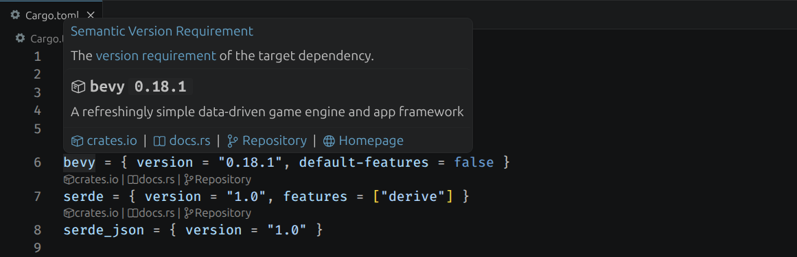

# Cargo Quick Links

Navigate to crate documentation, crates.io pages, and source repositories directly from dependency lines in `Cargo.toml` — without leaving VS Code.

## Features

### Inline CodeLens links

Every crates.io dependency gets three clickable links directly above its line:

- **$(package) crates.io** — open the crate's page on [crates.io](https://crates.io)
- **$(book) docs.rs** — open the crate's API documentation on [docs.rs](https://docs.rs)
- **$(source-control) Repository** — open the crate's source repository (resolved lazily from crates.io metadata)

If a crate has no listed repository the link shows `$(circle-slash) No repository`. If the crates.io API is unreachable it shows `$(warning) Repository unavailable`.

Git-sourced dependencies (`git = "..."`) are skipped automatically. Path-based (`path = "..."`) local dependencies are hidden by default and can be shown via settings.

All dependency sections are supported:

- `[dependencies]`, `[dev-dependencies]`, `[build-dependencies]`
- `[workspace.dependencies]`
- `[target.'cfg(...)'.dependencies]`

### Rich hover cards

Hovering over any dependency line shows a popup with:

- Crate name and latest published version
- Short description
- Quick links to crates.io, docs.rs, repository, and homepage

Local path dependencies show a `$(folder) local path dependency` label. Git dependencies show a `$(git-commit) git dependency` label.

## Commands

| Command                         | Description                                                                                          |
| ------------------------------- | ---------------------------------------------------------------------------------------------------- |
| `Cargo: Clear Crate Info Cache` | Clears cached crate metadata and forces a refresh. Useful after publishing a new version of a crate. |

## Settings

| Setting                        | Type    | Default | Description                                               |
| ------------------------------ | ------- | ------- | --------------------------------------------------------- |
| `cargoTomlLens.enableCodeLens` | boolean | `true`  | Show or hide the inline CodeLens links.                   |
| `cargoTomlLens.showPathDeps`   | boolean | `false` | Show CodeLens and hover info for local path dependencies. |

## Notes

- Crate metadata is cached for one hour per session. Use **Cargo: Clear Crate Info Cache** to force a refresh.
- The extension activates automatically when a `Cargo.toml` is present in the workspace.
- No runtime dependencies — only the VS Code API and the public [crates.io REST API](https://crates.io/api/v1).

## License

[MIT](LICENSE)
